<div align="center">

# ✈️ When does model complexity actually pay off?

### Predicting US flight disruptions two hours before departure

**39 million flights · one pre-registered experiment · one untouched test year**

    

</div>

---

Every day about **21,200** US domestic flights are scheduled, and roughly **one in four**
leaves 15+ minutes late or never leaves at all. Two hours before departure there is still time to act: protect a tight
connection, re-crew, re-book a passenger, or leave for the airport later. The information available at that moment is
limited, though, and the natural data-science reflex is to throw a bigger model at it.

This project asks a sharper question: **which extra complexity actually earns its keep**, a smarter *algorithm* or more
*information*? I answer it with a model ladder, pre-registered hypotheses, a leakage test that time-travels, and a test
year that was evaluated exactly once.

> [!IMPORTANT]
> **The short answer: what the model knows matters far more than what the model is.**
> Knowing where the inbound aircraft is *right now* improves the forecast by **+21.7%**. Swapping
> logistic regression for gradient boosting adds **+11.0%**. Upgrading LightGBM to CatBoost adds
> **+0.3%**, at roughly 11× the training time per configuration.

<p align="center">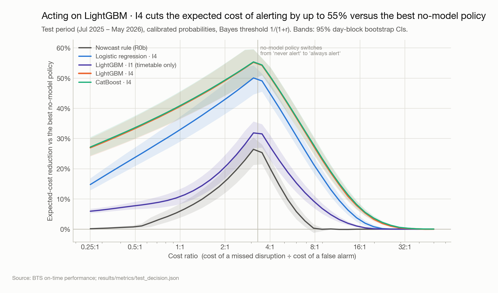<br>
<sub><b>How to read it:</b> each line is a model; the height is how much cheaper an alert policy built on it is than the best
policy that uses no model at all, across every ratio of "cost of missing a disruption" to "cost of a false alarm".
Bands are 95% day-block bootstrap intervals on the untouched test year.</sub></p>

## TL;DR

| | |
|---|---|
| 🎯 **Task** | P(departure ≥ 15 min late *or* cancelled), predicted at **t\* = scheduled departure − 2 h** |
| 📦 **Data** | 39,073,000 public BTS flights, Jan 2021 – May 2026, 65 monthly files audited one by one |
| 🏆 **Best model** | CatBoost · I4: Brier Skill Score **38.3% [37.0, 39.8]** vs climatology on 7,112,523 test flights. LightGBM · I4 (38.1% [36.8, 39.6]) is statistically equivalent and ~11× cheaper to train, so it powers the calibration, conformal and app sections |
| 📈 **Ranking** | PR-AUC **0.748** (LightGBM · I4) vs **0.350** for climatology |
| 💸 **Decision value** | Up to **55% lower expected alerting cost** than the best no-model policy |
| 🧭 **Trust** | Calibrated (test ECE 0.003); beats climatology in **all 23 months** up to two years after training |
| 🧪 **Rigor** | Time-travel leakage test · pre-registered hypotheses (hash `84a0e20280ee`) · test set accessed 1× · 22 tests passing |

**Contents:** [The pipeline](#the-pipeline) · [1 · The data fought back](#1--the-data-fought-back) ·
[2 · A line in time](#2--drawing-a-line-in-time) · [3 · What disruption looks like](#3--what-disruption-looks-like) ·
[4 · Delay travels with the aircraft](#4--delay-travels-with-the-aircraft) · [5 · The ladder](#5--the-ladder) ·
[6 · More data or more information?](#6--more-data-or-more-information) · [7 · From probability to decision](#7--from-probability-to-decision) ·
[8 · Can you trust the numbers?](#8--can-you-trust-the-numbers) · [9 · Where it holds, where it breaks](#9--where-it-holds-where-it-breaks) ·
[10 · What drives a prediction](#10--what-drives-a-prediction) · [11 · The clock matters](#11--the-clock-matters) ·
[So, when does complexity pay off?](#so-when-does-complexity-pay-off) · [Run it yourself](#run-it-yourself)

---

## The pipeline

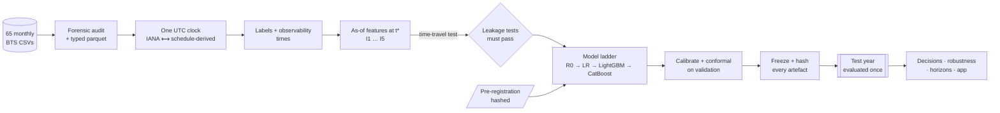

Everything is plain Python (`src/flightrisk/`), one command rebuilds it (`make all`), and **every number on this page is read
from `results/metrics/*.json`**. The README itself is rendered from those files, and the renderer refuses to run if a
sentence here stops matching the data.

---

## 1 · The data fought back

Before modelling anything I audited every file, one month at a time. The raw CSVs are never all held in memory.
Three surprises:

- **Spreadsheet damage.** In **36 of 65** files the `FL_DATE` column flips format exactly between day 12 and
  day 13. That is the fingerprint of a file opened and re-saved in a spreadsheet using a day-first locale: days 1–12 were
  silently re-interpreted as dates, days 13+ stayed text. `FL_DATE` is never used; dates are rebuilt from
  `YEAR / MONTH / DAY_OF_MONTH`.
- **Schema drift.** 7 files carry an extra column, a blank header or a junk column. Columns are mapped by *name*
  onto a canonical schema, and anything unknown fails loudly.
- **Internal consistency survives.** Invariants such as *actual departure = schedule + delay* and *cause columns present ⇔
  arrival 15+ min late* hold in essentially every row, so the damage was confined to text formatting.

<p align="center">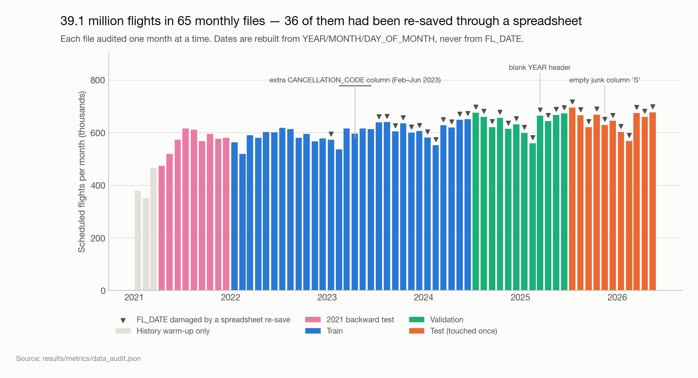</p>

<details>
<summary><b>🕐 Building one trustworthy clock (click to expand)</b></summary>

All times in the data are **local**, and ordering events across airports needs a single clock. Two independent sources:
IANA time zones for all 387 airports, and offsets **solved from the schedules themselves** (local arrival −
local departure − block time = offset difference, solved by least squares over the route graph). They agree for
**100%** of airports modulo 24 h. The only "disagreements" (GUM, SPN) differ by *exactly* one day: the
International Date Line. Rebuilding every scheduled arrival from UTC reproduces the file for **99.995%** of flights.

<p align="center">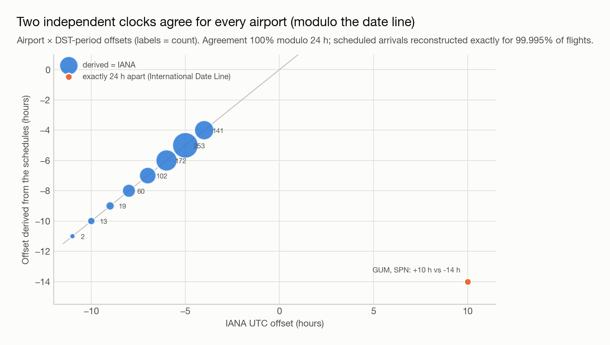</p>
</details>

---

## 2 · Drawing a line in time

The easiest way to build an impressive flight-delay model is to accidentally let it peek at the future. The rule here is strict:
**a feature at t\* may only use events an observer could have seen at t\***.

Every event in the database carries the moment it becomes observable. A push-back is known when it happens. A flight becomes
*known to be disrupted* 15 minutes after its scheduled time if it hasn't left, which holds for both long delays and
cancellations. A landing is known when it lands.

<p align="center">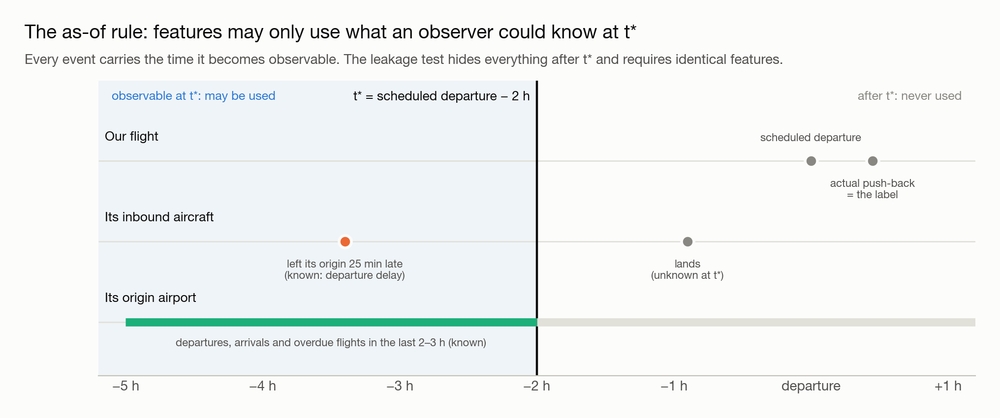</p>

> [!NOTE]
> **Leakage is tested, not promised.** The time-travel test rebuilds features from a copy of the database truncated to exactly
> what was known at t\* and requires them to be *bit-identical*. A deliberately leaky "canary" feature must fail the same test.
> It also caught a real bug during development: a window-dependent `leg_number`.

<details>
<summary><b>⚙️ How the as-of feature engine works</b></summary>

Every live-state feature is a question of the form *"at instant t, how many flights are in state X?"*. A flight is in a state
during an interval: *departed in the last 2 h* is `[dep, dep + 120)`, and *overdue at the gate* is `[sched, min(dep, sched + 6 h))`.
The count at t is `#(start ≤ t) − #(end ≤ t)`: two `searchsorted` calls over sorted keys offset by airport or carrier. It is
exact, vectorised over millions of flights, and as-of by construction, because intervals are built only from observable times.
The target itself is defined for **every** scheduled flight, cancellations included: at t\* nobody knows which flights will be
cancelled, and dropping them would make the worst days look easy.
</details>

---

## 3 · What disruption looks like

Outcomes for the test year stayed **masked** until the final evaluation, so the design could not be tuned to them. Over the
development period (Jan 2022 – Jun 2025) **22%** of flights were disrupted, climbing from
7% for 06:00 departures in October to
46% for 20:00 departures in July: delay accumulates through the day.

<p align="center">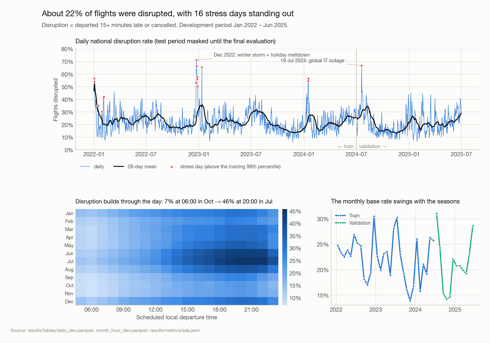</p>

Stress days were flagged **automatically** (above the training 99th percentile) and only named afterwards. The global IT outage
of **19 July 2024** shows up on its own: 67% of flights disrupted and 16% cancelled.
So does the December 2022 winter-storm meltdown, which peaked at 71% disrupted
on 2022-12-23, the worst day of the development period.

---

## 4 · Delay travels with the aircraft

The US network is hub-and-spoke: the 10 busiest airports handle **32%** of departures.

<p align="center">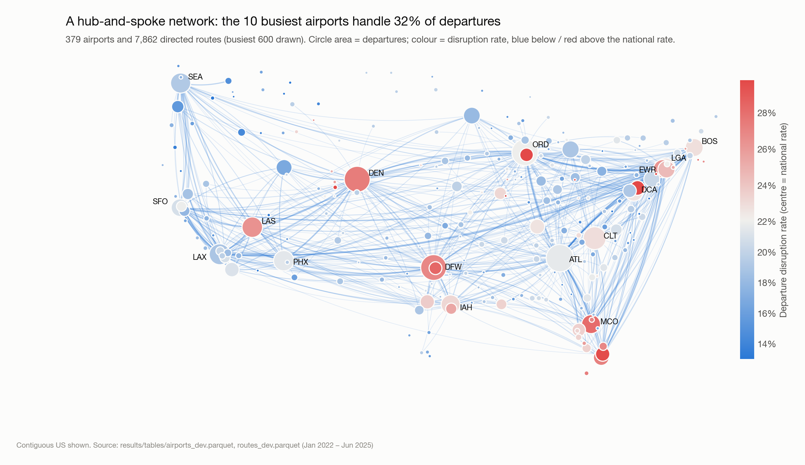</p>

Linking every aircraft's legs by tail number reveals the mechanism. After an inbound arrival 0–15 minutes late, the next
leg is disrupted **18%** of the time; after one 60–120 minutes late, **66%**. A 60-minute
"root" delay echoes down the rotation: 67% → 44% → 31% → 28% of
the following legs are disrupted, against about 16% after an on-time leg. BTS's own cause attribution puts
**39%** of all delay minutes on late-arriving aircraft.

<p align="center">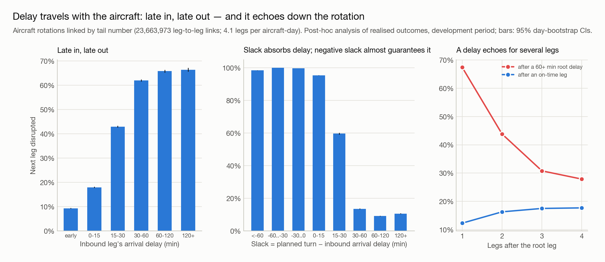</p>

That turns into a modelling idea: at t\* the inbound aircraft's status is **observable**. It may not have left yet, it may be
airborne with a known delay, or it may have landed.

---

## 5 · The ladder

To separate *knowing more* from *being more complex*, features come in five nested **information sets**, and several model
classes climb through them:

**What the model knows** (each set includes the ones above it):

| Set | Adds |
|---|---|
| **I1** | timetable, calendar, the aircraft's planned rotation, 28-day disruption history |
| **I2** | live airport, carrier and national state in the last 2–3 hours |
| **I3** | live status of the inbound aircraft (not yet departed · airborne with a known delay · landed) |
| **I4** | flights scheduled to arrive at the origin in the next 3 hours (the network) |
| **I5** | Gaussian-mixture "regime" probabilities (v1's idea) |

**What the model is:**

| Rung | Model | Why it is on the ladder |
|---|---|---|
| R0 | Climatology (empirical-Bayes rates by airport × carrier × month × time block) | the no-ML prior and the skill reference |
| R0b | One-weight nowcast rule | a transparent operations heuristic, so the models don't just beat a straw man |
| R1 | Logistic regression (splines, logit-scale rates) | the strongest simple model |
| R2 | LightGBM | the workhorse gradient-boosted trees |
| R3 | CatBoost | does a fancier booster help? |

Hypotheses, the primary metric (Brier Skill Score vs climatology), a **1% smallest effect of interest**, the Holm-adjusted
comparison family and every decision rule were **written down and hashed before anything was evaluated**. Models were trained
on 4,000,000 flights (Jan 2022 – Jun 2024) and calibrated on a validation year covering every
season. The test year (Jul 2025 – May 2026) was then evaluated exactly once, by a script that refuses to run unless all
22 frozen artefacts match their hashes.

<p align="center">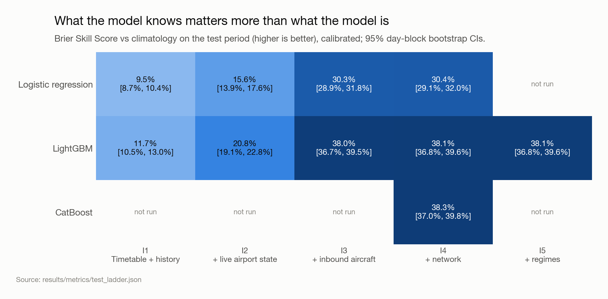</p>

**Reading the ladder (relative Brier improvement, paired 95% CI):**

| Step | Kind | Improvement | Verdict |
|---|---|---|---|
| I1 → I2 (live airport state) | information | +10.3% [+8.8, +11.8] | **pays off** (significant, above the 1% margin) |
| I2 → I3 (inbound aircraft) | information | +21.7% [+21.3, +22.1] | **pays off** (significant, above the 1% margin) |
| I3 → I4 (network) | information | +0.2% [+0.2, +0.3] | significant but below the 1% margin: negligible |
| I4 → I5 (regimes) | information | -0.1% [-0.1, -0.1] | significantly **worse** |
| LR → LightGBM at I4 | model class | +11.0% [+10.7, +11.3] | **pays off** (significant, above the 1% margin) |
| LR → LightGBM at I1 | model class | +2.4% [+1.4, +3.4] | **pays off** (significant, above the 1% margin) |
| LightGBM → CatBoost at I4 | model class | +0.3% [+0.3, +0.4] | significant but below the 1% margin: negligible |

<p align="center">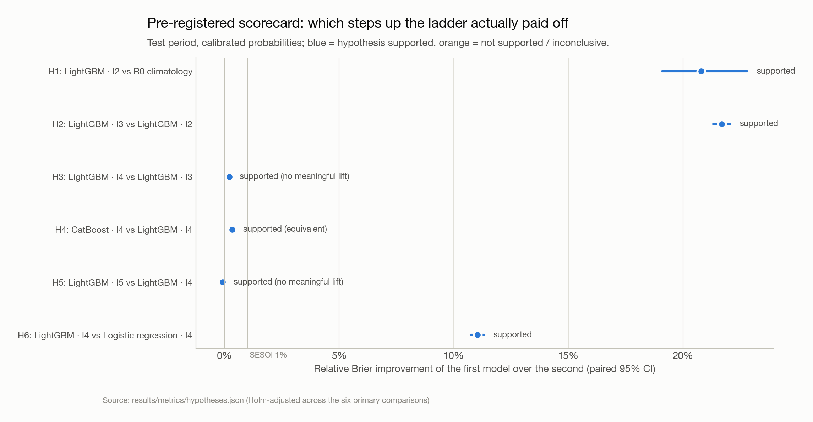</p>

<details>
<summary><b>📋 Full test-year results (calibrated, 95% day-block bootstrap CIs)</b></summary>

| Model | Brier skill vs climatology | PR-AUC | ROC-AUC | ECE |
|---|---|---|---|---|
| R0 climatology | 0.0% [0.0, 0.0] | 0.350 | 0.646 | 0.0300 |
| R0b nowcast rule | 5.9% [4.4, 7.5] | 0.434 | 0.692 | 0.0166 |
| Logistic regression · I1 | 9.5% [8.7, 10.4] | 0.483 | 0.723 | 0.0196 |
| Logistic regression · I4 | 30.4% [29.1, 32.0] | 0.682 | 0.828 | 0.0066 |
| LightGBM · I1 | 11.7% [10.5, 13.0] | 0.513 | 0.736 | 0.0073 |
| LightGBM · I2 | 20.8% [19.1, 22.8] | 0.605 | 0.789 | 0.0029 |
| LightGBM · I3 | 38.0% [36.7, 39.5] | 0.747 | 0.854 | 0.0034 |
| LightGBM · I4 | 38.1% [36.8, 39.6] | 0.748 | 0.855 | 0.0032 |
| LightGBM · I5 | 38.1% [36.8, 39.6] | 0.748 | 0.855 | 0.0033 |
| CatBoost · I4 | 38.3% [37.0, 39.8] | 0.750 | 0.856 | 0.0035 |

Pre-registered hypotheses:

| ID | Comparison | Relative Brier improvement [95% CI] | Holm p | Reading | Verdict (pre-registered rule) |
|---|---|---|---|---|---|
| H1 | LightGBM · I2  vs  R0 climatology | 20.79% [19.09, 22.81] | < 0.0005 | significantly better | supported |
| H2 | LightGBM · I3  vs  LightGBM · I2 | 21.69% [21.32, 22.07] | < 0.0005 | significantly better | supported |
| H3 | LightGBM · I4  vs  LightGBM · I3 | 0.22% [0.18, 0.26] | < 0.0005 | significantly better, but below the 1% margin | supported (no meaningful lift) |
| H4 | CatBoost · I4  vs  LightGBM · I4 | 0.34% [0.27, 0.42] | < 0.0005 | significantly better, but below the 1% margin | supported (equivalent) |
| H5 | LightGBM · I5  vs  LightGBM · I4 | -0.08% [-0.10, -0.06] | < 0.0005 | significantly worse | supported (no meaningful lift) |
| H6 | LightGBM · I4  vs  Logistic regression · I4 | 11.03% [10.75, 11.33] | < 0.0005 | significantly better | supported |

**Secondary pre-registered hypotheses**

| ID | Hypothesis | Verdict |
|---|---|---|
| H7 | GNN does not beat aggregated LightGBM | not tested in this version |
| H8 | Calibration lowers ECE for every rung; monthly bias drifts with prevalence | partly supported: ECE fell for 9 of 12 models; the predicted monthly drift with prevalence did not appear (r = -0.01) |
| H9 | Split conformal under-covers disrupted flights / high-disruption months; ACI shrinks the gap | supported: disrupted-flight coverage 60.9% (target 90%); monthly coverage vs prevalence r = -0.97; ACI shrinks the mean monthly gap (0.7 pp → 0.6 pp at γ=0.005, 0.4 pp at γ=0.05) |
| H10 | The live-information gain shrinks as the horizon grows | supported |
</details>

---

## 6 · More data, or more information?

A natural objection: maybe the richer models just need more data. The learning curve (validation data only) says no.
LightGBM with full information trained on **0.25M** flights (Brier 0.1041) beats the
timetable-only model trained on **4M** flights (Brier 0.1427). Extra data also helps the
information-rich model more: 16× more flights cut its Brier score by 3.1%, against
1.2% for the timetable-only model.

<p align="center">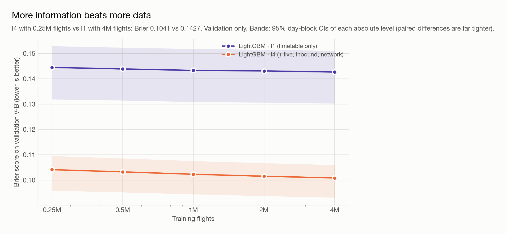</p>

A fairness check rules out a subtler objection. The pre-registered rule reused I4-tuned hyper-parameters for every
information set; giving the timetable-only model its own search changes its Brier score by
-0.06% (not significant).

---

## 7 · From probability to decision

A model only pays off if acting on it is cheaper. Suppose each flight can trigger an **alert**: a false alarm costs 1, a missed
disruption costs *r*. With calibrated probabilities the optimal rule is simply *alert when p ≥ 1/(1+r)*. The hero chart at the
top compares every rung with the best **no-model** policy (always or never alert).

- The savings peak at **55%** near a **3.1 : 1** cost ratio, right next to the point
  (≈ 3.3 : 1) where the no-model policy flips from "never alert" to "always alert". The decision is hardest there, so information is worth the most.
- Per 1,000 flights, adding live and inbound information (LightGBM · I4 over I1) saves up to **178**
  false-alarm units, gradient boosting over logistic regression up to **47**, and CatBoost over
  LightGBM at most **3.5**.
- At extreme cost ratios every sensible policy alerts on almost everything, the rungs converge, and complexity stops paying.

<details>
<summary><b>💸 Cost reduction by rung and cost ratio</b></summary>

| Cost ratio (miss : false alarm) | Bayes threshold | R0b nowcast rule | Logistic regression · I4 | LightGBM · I1 | LightGBM · I4 | CatBoost · I4 |
|---|---|---|---|---|---|---|
| 0.94 : 1 | 0.52 | 5.3% | 32.1% | 10.3% | 40.0% | 40.2% |
| 2.1 : 1 | 0.32 | 16.6% | 43.6% | 21.5% | 49.7% | 49.9% |
| 3.1 : 1 | 0.24 | 26.4% | 50.1% | 31.9% | 55.3% | 55.4% |
| 4 : 1 | 0.20 | 19.8% | 44.6% | 27.0% | 50.2% | 50.3% |
| 7.8 : 1 | 0.11 | 0.3% | 21.5% | 9.3% | 27.6% | 28.0% |
| 15 : 1 | 0.06 | -0.0% | 3.8% | 1.0% | 7.9% | 8.2% |
</details>

---

## 8 · Can you trust the numbers?

**Calibration.** Probabilities are recalibrated on validation data and never touched again. On the test year, LightGBM · I4's
expected calibration error is **0.003**, and its average monthly prediction stays within
-0.7 to +0.3 percentage points of reality, with a model frozen at its June 2024 cut-off.

<p align="center">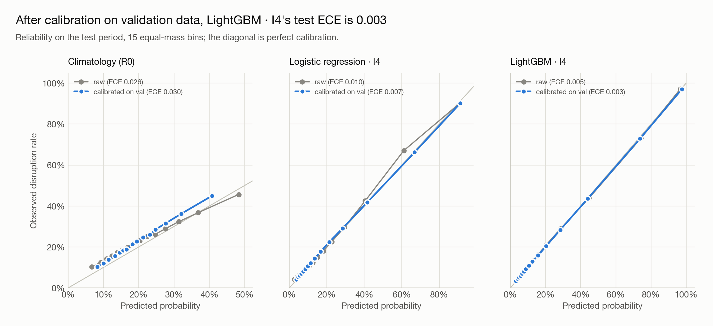</p>

<p align="center">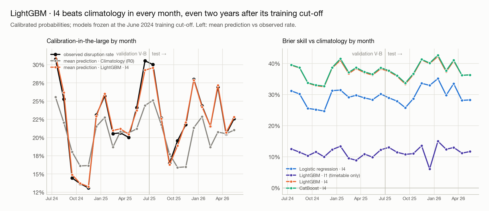</p>

**Uncertainty.** Conformal prediction wraps each forecast in a set ({on time}, {disrupted} or {either}) that should contain
the truth 90% of the time. It does overall (**89.6%**), but only for **60.9%** of
the flights that were actually disrupted. Coverage also falls in high-disruption months (r = -0.97), which is
the exchangeability assumption visibly breaking under drift. **Class-conditional conformal** repairs it:
90.9% on disrupted flights.

<p align="center">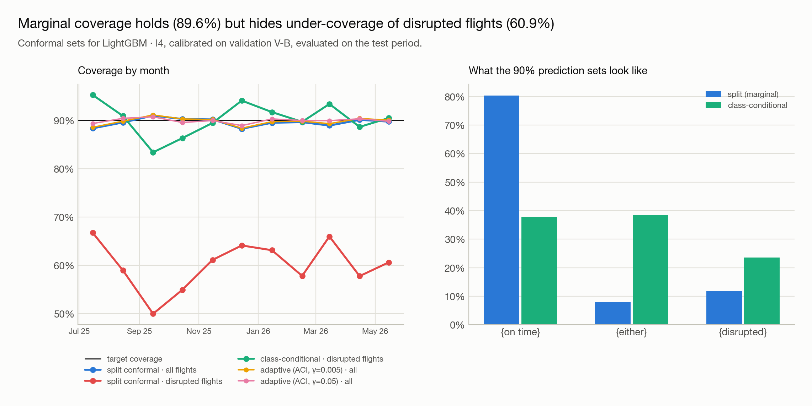</p>

---

## 9 · Where it holds, where it breaks

Verdict rules were pre-registered. Across 34 segments (seasons, stress days, the 15 busiest airports and 10 largest
carriers) the model **holds in 32** and **degrades in 2**; none break. It is strongest precisely when it matters:
BSS **64%** on stress days and **76%** when the inbound aircraft is already late. Its weak spot is the
first flight of the day (27%), where there is no inbound aircraft to read.

<p align="center">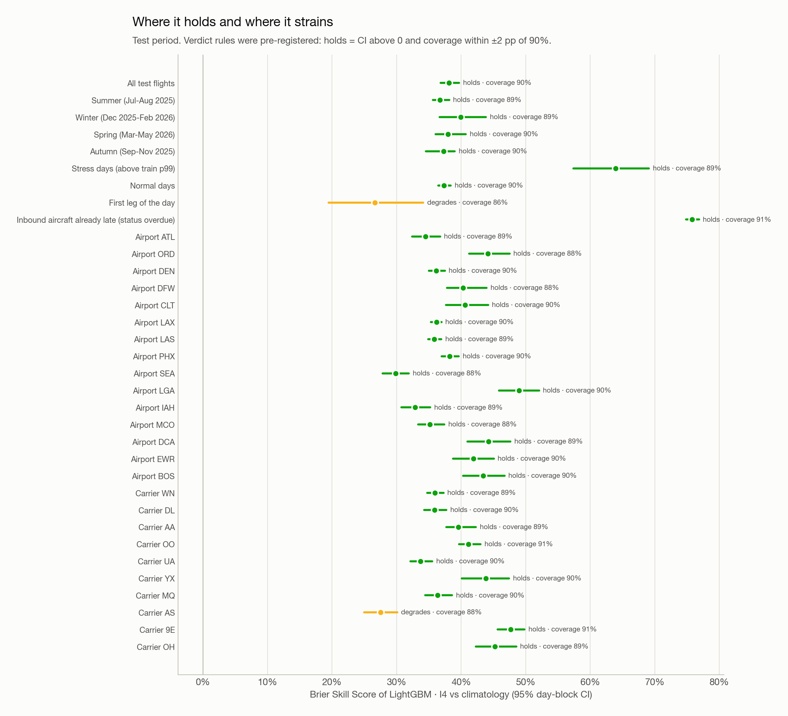</p>

A backward test on **2021**, a pandemic-recovery year the model never saw, still gives BSS **34.2% [33.2, 34.8]**.

---

## 10 · What drives a prediction

TreeSHAP on a test sample. The single strongest driver is **inbound aircraft: turn slack after known delay**, and the inbound-aircraft
features carry **37%** of all attribution, more than the whole timetable-and-history set
(35%).

<p align="center">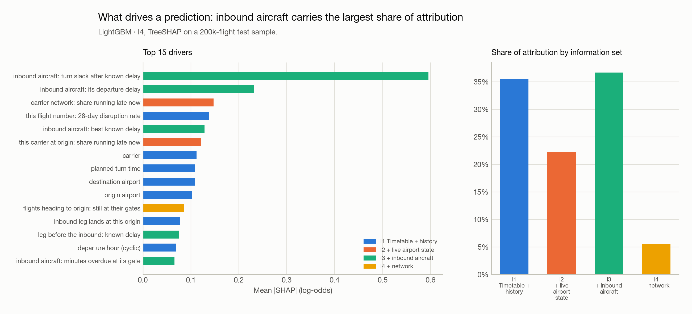</p>

---

## 11 · The clock matters

Live information is perishable. Retraining the same model at other horizons (same flights, frozen hyper-parameters), the
gain from live + network information over the timetable is **42.5%** at 30 minutes,
**29.6%** at 2 hours and **8.6%** at 6 hours before departure.

<p align="center">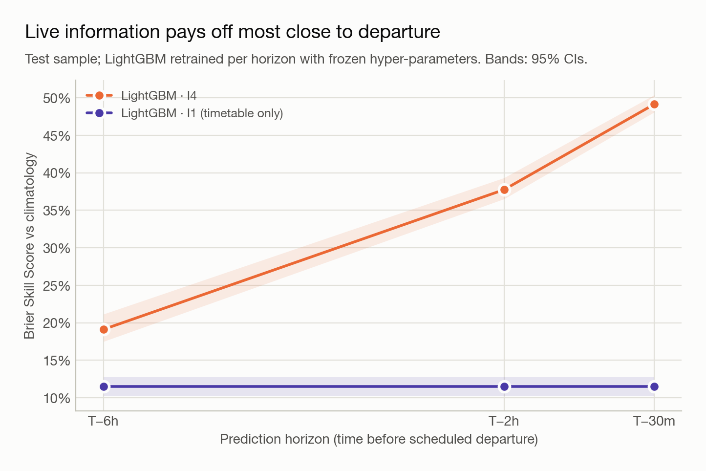</p>

---

## So, when does complexity pay off?

1. **Information pays off first.** Live airport state and, above all, the inbound aircraft's status account for most of the
   gain. The rest of the network adds almost nothing once you know where your own plane is.
2. **Algorithmic complexity pays off second, and only with something to work with.** Gradient boosting beats logistic
   regression by +2.4% on timetable features but by +11.0% once live information arrives.
3. **Beyond that, complexity stops paying.** CatBoost, network features and regime features each land inside the pre-registered
   1% margin, and regimes are even slightly harmful (-0.1%). That replicates the v1 null result on a far
   larger test set.
4. **Decision value is concentrated where decisions are hardest**, near the cost ratio where the no-model policy flips.
5. **Trust has to be measured.** Calibration transferred across two years; conformal coverage did not, until it was made
   class-conditional.

> [!TIP]
> **Negative results are results.** Knowing that CatBoost, regimes and network features do *not* pay off here saves real
> engineering time. The honest version of this project is also the more useful one.

---

## Run it yourself

```bash
make env     # Python 3.11 via uv, pinned by uv.lock
make all     # rebuilds every missing stage from the raw zip, then executes the notebook
make test    # unit tests + time-travel leakage tests
.venv/bin/streamlit run app/streamlit_app.py   # replay real test-year flights at T-2h
```

The raw archive goes at `data/raw/bts_ontime_2021-01_2026-05.zip` (hashes in `data/raw/MANIFEST.json`). On a 16 GB laptop a
full rebuild takes a few hours, most of it CatBoost.

**Streamlit app.** Pick a real test-year flight and see its calibrated T−2h risk, its 90% conformal set, the top drivers in
plain English, a recommended action for your cost ratio, and what-if sliders for the inbound delay and airport state. It
ships a 45 MB self-contained bundle, ready for
Streamlit Community Cloud.

<details>
<summary><b>🗂️ Repository map</b></summary>

```
src/flightrisk/      io/ (audit, ingest) · timeutil/ (UTC clock) · core.py (labels, observability)
                     features/ (as-of engine, registry) · models/ (ladder, predictors) · evaluation/
                     (metrics, block bootstrap, report) · calibration · conformal · viz/ · reporting/
scripts/             one script per pipeline stage (ingest → … → evaluate final → render docs)
tests/               time-travel leakage + canary, primitives vs brute force, labels, UTC, bootstrap, app parity
configs/             data schema, splits, pre-registration (+ amendment A1)
notebooks/           flight_disruption_story.ipynb: the full story, executed, 20 sections
results/metrics/     every number in this README        results/figures/   every chart
app/                 Streamlit replay app + bundle      docs/              one-pager, glossary, model card, decisions
```
</details>

<details>
<summary><b>⚠️ Limitations: read before trusting any number</b></summary>

- **Aircraft swaps are invisible** in public data; inbound-aircraft features are therefore an optimistic upper bound.
- **Cancellation announcement times are unknown**; the as-of rule treats them conservatively.
- **No weather or FAA ground-delay programme data**; live airport state is only a proxy.
- **Frozen models**: trained to June 2024 and never retrained, so this is a conservative, stale-model test.
- **CatBoost is budget-limited** (pre-registered amendment A1: 3 configurations instead of 8), so its small edge is a lower bound.
- **Third-party archive** with spreadsheet artefacts. Internal invariants hold, but no byte-level cross-check against official BTS files was done.
- **No GNN rung** in this version (hypothesis H7 not tested).
</details>

---

<div align="center">

**Sabarish G** · MSc Business Analytics · public data only (US DOT / Bureau of Transportation Statistics)

*Full narrative:* [`notebooks/flight_disruption_story.ipynb`](notebooks/flight_disruption_story.ipynb) ·
*Design:* [`PLAN.md`](PLAN.md) · *Decisions:* [`docs/decisions.md`](docs/decisions.md) ·
*Plain English:* [`docs/one_pager.md`](docs/one_pager.md) · [`docs/glossary.md`](docs/glossary.md) · [`docs/model_card.md`](docs/model_card.md)

<sub>Not affiliated with any airline or with BTS. Every number above is generated from <code>results/metrics/*.json</code>.</sub>

</div>
